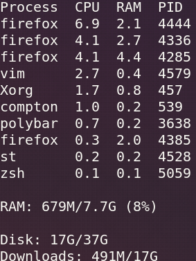
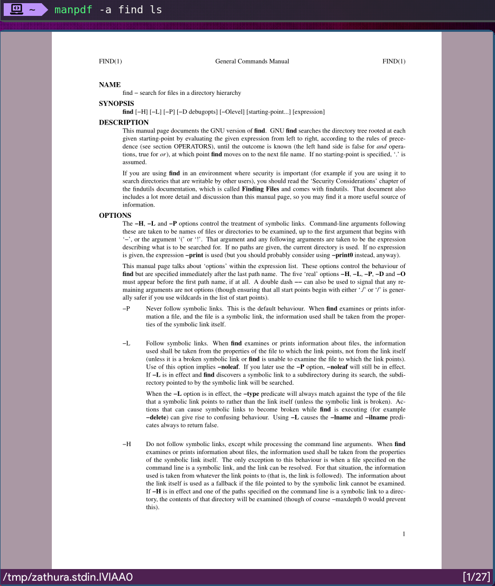
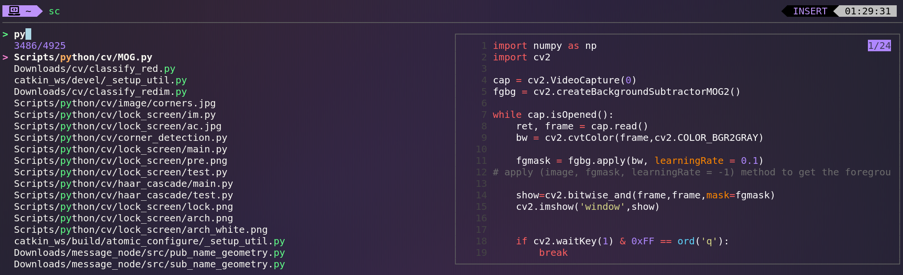
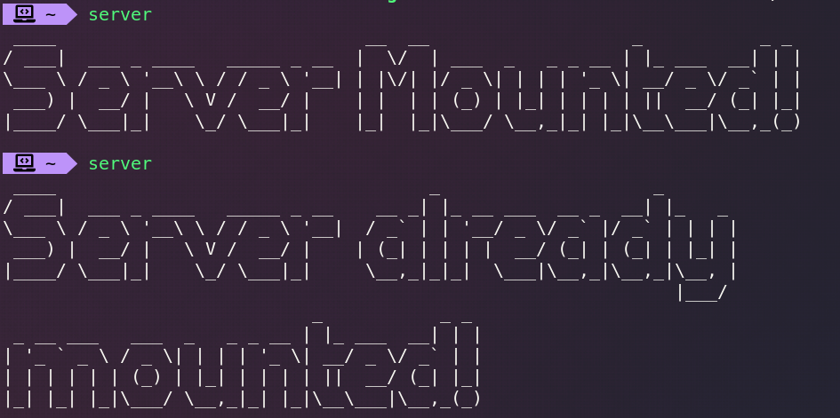
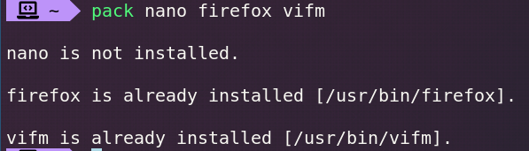
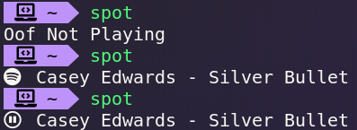

# Shell Scripts

### A directory in my system where I store all my commonly used .sh scripts, and automatically create alias in the name of the script to run and manage them more easily.

---

# Table of Contents

1. [How it works](#CreationOfAlias)
2. [Environment](#Environment)
3. [Description](#Descriptions)
    1. [system_info](#system_infosh)
    2. [countdown](#countdownsh)
    3. [man_page_pdf](#man_page_pdfsh)
    4. [fuzzy_search](#fuzzy_searchsh)
    5. [mount_server](#mount_serversh)
    6. [check_package](#check_packagesh) 
    7. [spotify_status](#spotify_statussh)


## CreationOfAlias:
Every time a buffer of '.sh' file is written, vim will execute 'alias.sh' with the argument of all the .sh file names (except for alias.sh) in that directory. The command for creating alias will be output to the file 'alias' and thus be sourced next time I login to zsh.

## Environment
### System: Arch Linux
### Shell: zsh
```
source ~/Scripts/MY/alias 
# in my ~/.zshrc
```
### Editor: Vim
```
autocmd BufWritePost ~/Scripts/MY/*.sh !chmod +x %; ~/Scripts/MY/alias.sh $(ls ~/Scripts/MY | ack -v alias | ack ".+\.sh$"); 
# in my ~/.vimrc
```

#### Note: ack is equivalent to grep or egrep

---

## Descriptions

### system_info.sh 

Display system information in my favor.

Text manipulation on 'ps', 'free' and 'df'.

basic calculation.



---

### countdown.sh 

A countdown utility depends on lolcat and figlet.


---

### man_page_pdf.sh 

a script that automatically merge and output man page to zathura pdf viewer

zathura-pdf-mupdf or zathura-pdf-poppler needed.



---

### fuzzy_search.sh

a script that makes fzf works better and more customized to one's favour.

- preview with bat
- open the file on select instead of getting a standard output



---

### mount_server.sh 

a simple command to mount my server to the mount point using sshfs.

please don't attack it for god's sake lol.



---

### check_package.sh 

a script that check if input argument are installed in the system and output their binaries' location.



---

### spotify_status.sh 

display whether and what is being played on spotify.

combining with polybar to implement this function in the status bar.



---

#### Please don't be mean if you find these clumsy and inelegant.
